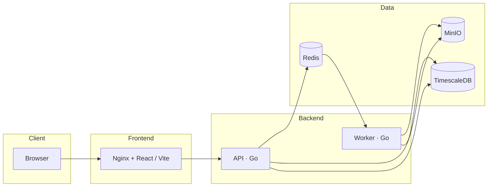
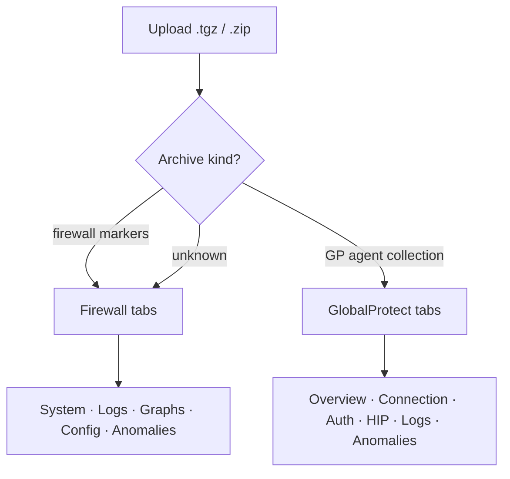
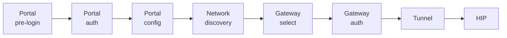

# Palo Log Analyser

<p align="center">
  
  
  
</p>

<p align="center">
  <strong>PAN TechSupport Analyzer</strong><br/>
  Upload, parse, search, and diagnose Palo Alto Networks firewall tech-support<br/>
  archives and GlobalProtect agent log collections — in the browser.
</p>

<p align="center">
  <a href="#architecture"></a>
  <a href=".github/workflows/ci.yml"></a>
  
  
</p>

### Tech stack

<p align="center">
  
  
  
  
  <br/>
  
  
  
  
  
</p>

<p align="center">
  
  
  
  
  
</p>

---

## What it does

| | Capability |
|---|---|
| 🔥 | **Firewall tech-support** — system info, logs, counters, config, OOM / anomalies |
| 🛡️ | **GlobalProtect agent** — connection stages, gateway select, HIP, auth |
| 🔎 | **Boolean search** — `AND` / `OR` / `NOT`, phrases, `-A`/`-B`, awk-style `| $2 > n` |
| 📈 | **Counter graphs** — pan / zoom time-series across monitor dumps |
| ⚙️ | **Config browser** — Policies / Objects / Network / Device style nav |

```bash
cp .env.example .env
docker compose up --build
# UI  → http://localhost:8080
# API → http://localhost:8081/healthz
```

### npm (CLI)

Requires [Docker Desktop](https://docs.docker.com/get-docker/) (or Engine + Compose v2).

**Public npmjs.org**

```bash
npm install -g palo-log-analyser
palo-log-analyser doctor
palo-log-analyser start
palo-log-analyser open
```

Or one-shot without installing:

```bash
npx palo-log-analyser start
```

**GitHub Packages** (shows under the repo’s Packages sidebar)

```bash
# ~/.npmrc
# @tufaylahmed:registry=https://npm.pkg.github.com
# //npm.pkg.github.com/:_authToken=YOUR_GITHUB_TOKEN

npm install -g @tufaylahmed/palo-log-analyser
```

Package pages:
- npmjs: https://www.npmjs.com/package/palo-log-analyser
- GitHub: https://github.com/TufaylAhmed/palo-log-analyser/pkgs/npm/palo-log-analyser

| Command | What it does |
|---------|----------------|
| `start` | `docker compose up --build -d` |
| `stop` | tear the stack down |
| `restart` | stop + start |
| `status` | compose `ps` |
| `logs` | follow service logs |
| `open` | open http://localhost:8080 |
| `doctor` | check Docker / Compose |

---

## Architecture

Target layout (Compose services). Today the **api** still does inline parse + in-memory store; Postgres / MinIO / Redis / worker are wired for the production path.



| Service | Role |
|---------|------|
| **api** | Uploads, file registry, parsed-data queries, graph data |
| **worker** | Extract `.tgz`, run regex parsers, write results |
| **postgres (TimescaleDB)** | Metadata, system info, logs index, counter hypertables |
| **minio** | S3-compatible storage for raw archives |
| **redis** | Job queue (asynq) |
| **frontend** | React + TypeScript (Vite) — System Info · Logs · Graphs · Config · My Files |



> **Current state (vs. target above).** As built today, the **api** is the only backend process doing real work: it stores raw `.tgz` files on a **local disk volume** (not MinIO), keeps the file registry and all parsed data in an **in-memory store** (not Postgres/TimescaleDB), and runs the parsers **inline in a goroutine** right after upload (not via Redis/asynq in the **worker**, which is still a stub). The store sits behind a `store.Store` interface so a Postgres-backed implementation can drop in without touching the API or parsers. The Go backend is currently **stdlib-only** (empty `go.mod` dependencies).

### Two kinds of archive

The tool takes both a **firewall tech-support file** and a **GlobalProtect agent log
collection** (the `.tgz` the GP app's "Collect Logs" produces on an endpoint). They go
to the same upload box; the kind is detected from the archive's own file list during
the first parse pass, shown as a badge in My Files, and decides which tabs open.

Firewall evidence always wins. A tech-support file from a firewall running
GlobalProtect contains portal and gateway logs whose names look much like the agent's,
whereas an endpoint collection never has `/opt/pancfg`, a CLI dump or dataplane monitor
logs — so one firewall marker outweighs any number of GP-looking names. An archive that
matches neither, but is small, flat and mostly `.log` files, is treated as an agent
collection; anything else is left unrecognised and parsed as a firewall file.

Parse passes that read PAN-OS-only material (counters, config, OOM analysis, app stats,
licences) are skipped for an agent bundle. The archive index and search index are built
for both, so browsing and searching work either way.

A `.zip` (what the Windows GP app produces) is converted to `.tar.gz` once at upload,
decided by the file's magic bytes rather than its extension, so the index, search blob
and every parser see one container format.

**GP tabs:** Overview · Connection · Authentication · HIP & Network · Log Files ·
Anomalies. Overview, Connection and Log Files are implemented; the other three are
scaffolded.

#### Connection flow



A connection is a fixed sequence, each stage reachable only if the one before it
succeeded. Each attempt in the log is segmented and scored against that sequence, so
the Connection tab reports *where* it stopped rather than only that it failed —
"57 attempts, 37 stopped at gateway select" is the diagnosis.

Gateway selection gets its own table, because the agent's error for every failure there
is the same unhelpful sentence about the network being unreachable. The table shows each
gateway's priority, whether the client's source address matched the gateway's configured
region, the measured TCP response time, and which one won. A region mismatch scores a
gateway **-2** and silently removes it from contention — the common cause of "connected
to the portal but never to a gateway", and exactly what the sample bundles showed: the
gateway answered in 20 ms but its region was `0.0.0.0-0.255.255.255` while the portal
placed the client in `10.0.0.0-10.255.255.255`.

With more than one gateway, priority and response time both count. Since app 4.0.3 the
highest/high/medium priorities are tried ahead of low/lowest regardless of response
time, with the low ones appended after; before 4.0.3 a slower high-priority gateway
could lose outright to a faster low-priority one. See
[Gateway Priority in a Multiple Gateway Configuration](https://docs.paloaltonetworks.com/globalprotect/administration/globalprotect-gateways/gateway-priority-in-a-multiple-gateway-configuration).

Two things the parser has to get right, both found by running it over real collections:
rotated logs must be read **oldest first** (a tar lists members in arbitrary order, so
reading `PanGPS.1.log` after `PanGPS.log` let a stale round overwrite the current one),
and scoring is grouped into **rounds** delimited by `Parse gateway list`, with only the
last round reported — earlier rounds can belong to a different portal entirely.

#### GP log formats

The agent writes three line formats, all handled, and the right parser is chosen by
sniffing a file's opening lines:

```
08/18/2026 13:55:40:423 [Info ]: portal status is Connected.          event logs
(P11496-T6520)Info (11298): 08/18/26 13:55:40:474 Connect method …    component logs
(P11496-T14080)debug08/18/26 09:41:41:742 (152): [CP_DETECT] …        captive-portal log
```

Two of those were only found by measuring parser coverage against a real 6.3.3
collection: `PanGPA.log` indents its lines by one space, and `pan_cp_events.log`
orders the fields differently and runs a long severity straight into the date
(`debug08/18/26`), so the severity has to be matched as letters only. A line matching
no format is treated as a continuation of the entry above it and keeps its timestamp —
in the sample bundle 24,000 of `PanGPA.log`'s lines are multi-line JSON dumps.

The process and thread tag leads each component-log message rather than being
discarded: the agent is two programs — PanGPS, the service that does the work, and
PanGPA, the UI that relays commands to and from it — so following a connection means
following a conversation between threads, and `P…-T…` is what makes one thread's story
separable and searchable.

### Search syntax

```
ospf AND down             AND / OR / NOT, also && || !, with parentheses
"exact phrase"            quoted terms match literally; bare terms are regexes
failed -A 3 -B 2          grep-style context lines after / before a match
pkt_recv | $2 > 10000     awk-style field filter on the lines found
sessions | -F',' $3 > 500 …with an explicit separator
```

The pipe clause is the `| awk` half: `$1`, `$2`… are fields counted **from the
message**, with a leading timestamp and severity/subsystem label skipped, so on
`2026/08/04 21:00:20 medium general pkt_recv 4523` `$1` is `pkt_recv` and `$2` is
`4523`. `$0` is the whole line. Operators are `> >= < <= == != ~ !~`, combined with
`AND` / `OR`. Values carrying units parse as numbers (`1400000kB`, `85%`, `4523,`).

Fields are whitespace-separated by default. `-F` changes that, following awk's own
rule: one character is a literal separator, anything longer is a regular expression,
and a space means runs of whitespace.

```
sessions | -F',' $3 > 500        comma-separated
route    | -F: $2 ~ down         colon; quotes optional
counters | -F'\t' $2 > 1000      tab
route    | -F'\s*:\s*' $2 ~ down separator with padding, as a regex
```

`-F` changes only what a field *is*, never where the message starts, so field numbers
mean the same thing with or without it. Empty fields are preserved (`a,,b` has three,
so numbering does not shift across a gap) and each field is trimmed.

Like the pipeline it imitates, the filter applies to matched lines **and** their
`-A`/`-B` context, so `pkt_recv -A 10 | $2 > 10000` works when the match is a section
header and the values are underneath it: the header is kept as the anchor, dimmed,
and the block disappears only if nothing in it survives. A clause that cannot be
parsed is ignored entirely rather than half-applied, and the UI says so.

### Search index

Searching the `.tgz` directly meant inflating the whole archive per query, which
made broad searches time out. Parsing now builds two artefacts up front:

- a **blob** (`<archive>.sblob`, beside the upload) holding every text file's bytes
  uncompressed, with a span table — searching a file becomes a read at an offset;
- a **trigram index** mapping each 3-byte sequence to the files containing it, so a
  query's required trigrams narrow thousands of files to the few that could match.

The index may only *narrow* a search. Anything the planner cannot prove is required
— alternation, `NOT`, a bare character class — degrades to "every file is a
candidate", and equivalence tests assert the indexed path returns exactly what a full
scan returns. If the blob is missing, search falls back to scanning the archive.

Cost: the blob is roughly the uncompressed size of the archive (a 100 MB `.tgz` is
around 1 GB), stored in the `upload-data` volume and deleted with its file. Stale
blobs are cleared at startup, since the in-memory registry does not survive a restart.

## Quickstart (dev)

```bash
cp .env.example .env
docker compose up --build
# frontend: http://localhost:8080   api: http://localhost:8081/healthz
```

Without Docker:

```bash
cd backend && go run ./cmd/api      # api on :8081
cd frontend && npm install && npm run dev
```

## Roadmap

Legend: `[x]` done · `[~]` partial (works in-memory; production backing store still pending) · `[ ]` not started

- [x] Phase 1 — scaffold, CI, stub upload endpoint, frontend shell
- [~] Phase 2 — file registry + upload storage
  - [x] file registry behind `store.Store` interface, upload/list/get/delete API
  - [ ] back the registry with Postgres and move raw blobs to MinIO (today: in-memory + local disk)
- [~] Phase 3 — extraction + system-info parser
  - [x] archive indexer, `show system info` extractor (version, serial, licenses, …)
  - [ ] move extraction into the **worker** via Redis/asynq (today: inline goroutine in the api)
- [x] Phase 4 — log viewer + log parsing (archive browser, search, monitor-log structurer, time-range filter, virtualized viewer)
- [~] Phase 5 — counters → graphs
  - [x] counter parsers (global/per-task/CPU/cache/ifconfig/memory/logrcvr/netstat) and ECharts plotting
  - [ ] persist counters to a TimescaleDB hypertable (today: in-memory series)
- [ ] Phase 6 — config tab, cascade delete, auth/quotas

## Repository layout

```
backend/    Go API (active) + worker (stub). Currently stdlib-only;
            pgx/asynq/minio land when Phases 2–3 move off the in-memory store.
frontend/   React + TS (Vite)
.github/    CI pipeline
```
